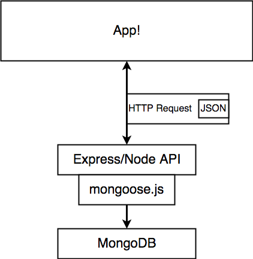

### MongoDB-Mongoose-Express-Node.js


The diagram above shows the interaction between the different stacks. 

### Storing info

Mongo stores record in different collections. Every collection can have many different records. Every records is a JSON object.  Collections are schemaless; inside of every collection records with different properties can be included. 

### Mongoose
Mongoose is an Object Document Mapper (ODM). This means that Mongoose allows you to define objects with a strongly-typed schema that is mapped to a MongoDB document. Mongoose provides functionality around creating and working with schemas. 


### Define types
SchemaTypes handle definition of path defaults, validation, getters, setters, field selection defaults for queries, and other general characteristics for Strings and Numbers. The following are all the valid SchemaTypes in mongoose.
- String
- Number
- Date
- Buffer
- Boolean
- Mixed
- ObjectId
- Array
- Decimal128
- Map

```js
const mongoose = require('mongoose');

const { Schema } = mongoose;

const userSchema = new Schema({
  googleId: String,
  credit: Number
});

mongoose.model('users', userSchema);
```


### Subdocuments
Subdocuments are documents embedded in other documents. In Mongoose, this means you can nest schemas in other schemas. Mongoose has two distinct notions of subdocuments: arrays of subdocuments and single nested subdocuments.</br>


Subdocuments are similar to normal documents. Nested schemas can have middleware, custom validation logic, virtuals, and any other feature top-level schemas can use. The major difference is that subdocuments are not saved individually, they are saved whenever their top-level parent document is saved.

#### Example
###### Setting-up Sub-Document
```js
const mongoose = require('mongoose');
const { Schema } = mongoose;

const recipientSchema = new Schema({
  email: String,
  responded: { type: Boolean, default: false }
});

module.exports = recipientSchema;
```
###### Import in Top-Level Document
```js
const mongoose = require('mongoose');
const { Schema } = mongoose;

const RecipientSchema = require('./Recipient');

const surveySchema = new Schema({
  title: String,
  body: String,
  subject: String,
  recipients: [RecipientSchema],
  yes: { type: Number, default: 0 },
  no: { type: Number, default: 0 }
});

mongoose.model('survey', surveySchema);
```

#####
When you now pass in a array of object, it will automatically create subdocuments for you. 

#### Relationship setting
In the example below  we indicate that a document(a survey) is owned by another document(a user). 
- __ :  underscore is not required, but it is convention to indicate it is a reference/relationship field
- Type:  we indicate that is has an type that is the id of the user that owns a record
- Ref: the reference we are making belongs to the user collection
```js
const mongoose = require('mongoose');
const { Schema } = mongoose;

const RecipientSchema = require('./Recipient');

const surveySchema = new Schema({
  title: String,
  body: String,
  __user: { type: Schema.Types.ObjectId, ref: 'user'}
});

mongoose.model('survey', surveySchema);
```


