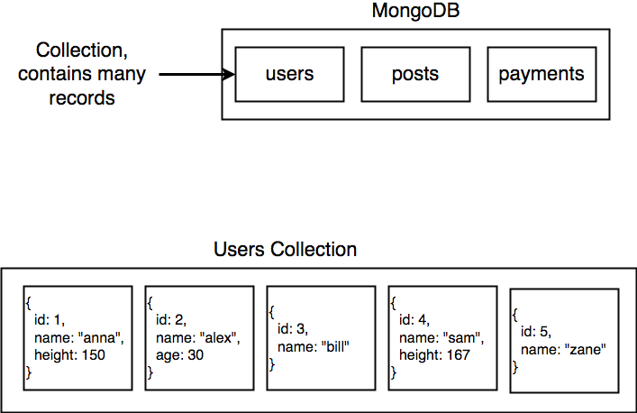

### Overview

The diagram above shows the interaction between the different stacks; MongoDB-Mongoose-Express-Node.js. 

### Mongoose
Mongoose allows you to communicate with Mongo. It is an Object Document Mapper (ODM), which means that Mongoose allows you to define objects with a strongly-typed schema that is mapped to a MongoDB document. Mongoose provides functionality around creating and working with schemas. 


### CRUD
Mongoose/Mongo has 4 main core operations:
- Create
- Read
- Update
- Destroy

### Collections/Models/Classes, Instances, Schemas


**Collections/models/classes:** Mongo stores record in different collections/models/classes; these are representations of resources (a collection books or a collection of states). 

**Instances:** Every collection can have many different instances/records; it represent a single resources (e.g. the book 'Siddharta'). Every records is a JSON object. 

**Schema:** A schema defines which properties you expect each record of the collection to have and what type of data it is (see header 'Data Types' below). It's a component of a model/collection. 

### Data Types
SchemaTypes handle definition of path defaults, validation, getters, setters, field selection defaults for queries, and other general characteristics for Strings and Numbers. The following are all the valid SchemaTypes in mongoose.
- String
- Number
- Date
- Buffer
- Boolean
- Mixed
- ObjectId
- Array
- Decimal128
- Map

Example: 
```js
const mongoose = require('mongoose');

const { Schema } = mongoose;

const userSchema = new Schema({
  googleId: String,
  credit: Number
});

mongoose.model('users', userSchema);
```
