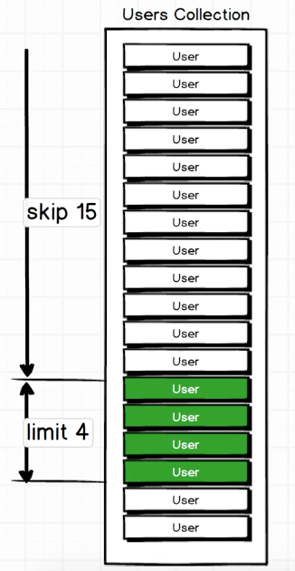

To work with pagination we have two query modifiers:
- `skip`:  You start with a skip value of zero, once you start to increment you skip a certain amount of records. So, in the example below we skip the first 15 results. 
- `limit`: It limits the amount of results you get back of the query. 

