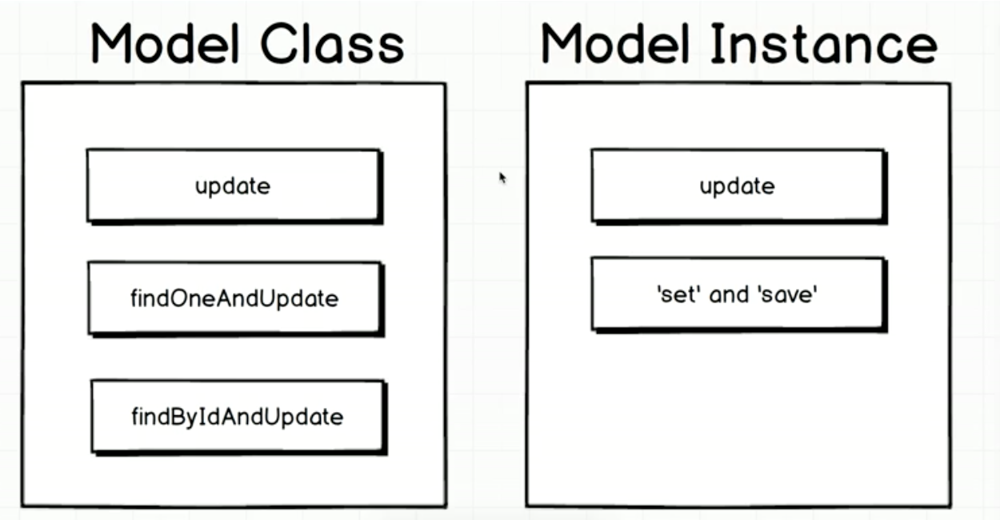

```js
const assert = require('assert');
const User = require('../src/user');

describe('Updating records', () => {
  let joe;

  beforeEach((done) => {
    joe = new User({ name: 'Joe', postCount: 0 });
    joe.save()
      .then(() => done());
  });

  // e.g. operation =  'joe.update({ name: 'Alex' }'
  function assertName(operation, done) {
    operation
      .then(() => User.find({}))
      .then((users) => {
        assert(users.length === 1);
        assert(users[0].name === 'Alex');
        done();
      });
  }

  it('a INSTANCE type using set n save', (done) => {
    // through .set you can update an property
    joe.set('name', 'Alex');
    // it is not updated in the db, untill you hit save
    assertName(joe.save(), done);
  });

  // can update multiple properties
  it('A model INSTANCE can update', (done) => {
    assertName(joe.update({ name: 'Alex' }), done);
  });

  /*
    first we select, than we update the selected
  */
  it('A model class can update', (done) => {
    assertName(
      User.update({ name: 'Joe' }, { name: 'Alex' }),
      done
    );
  });

  it('A model CLASS can update one record', (done) => {
    assertName(User.findOneAndUpdate({ name: 'Joe' }, { name: 'Alex' }), done);
  });

  it('A model CLASS can find a record with an Id and update', (done) => {
    assertName(
      User.findByIdAndUpdate(joe._id, { name: 'Alex' }),
      done
    );
  });
});
```
