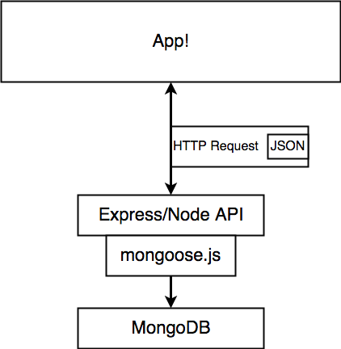
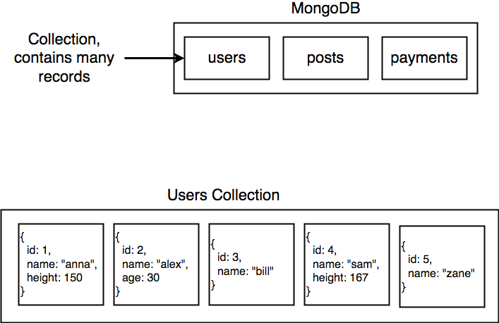
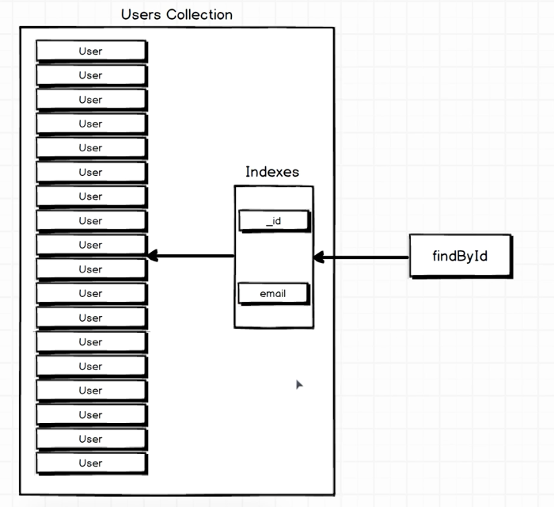

### Overview

The diagram above shows the interaction between the different stacks; MongoDB-Mongoose-Express-Node.js. 

### Mongoose
Mongoose allows you to communicate with Mongo. It is an Object Document Mapper (ODM), which means that Mongoose allows you to define objects with a strongly-typed schema that is mapped to a MongoDB document. Mongoose provides functionality around creating and working with schemas. 

### CRUD
Mongoose/Mongo has 4 main core operations:
- Create
- Read
- Update
- Destroy

### Collections, Schema, Instances, Models, Fields. 

**Collections:** Mongo stores record in different collections. These are representations of resources (a collection books or a collection of states). ‘Collections’ in Mongo are equivalent to tables in relational databases. They can hold multiple JSON documents.

**Schema's:** A schema defines which properties you expect each record of the collection to have and what type of data it is (see header 'Data Types' below). It's a component of a model/collection. MongoDB is a schema-less NoSQL document database. It means you can store JSON documents in it, and the structure of these documents can vary as it is not enforced like SQL databases. This is one of the advantages of using NoSQL as it speeds up application development and reduces the complexity of deployments. While Mongo is schema-less, Mongoose's ‘schema’ is a document data structure (or shape of the document) that is enforced via the application layer

**Instances:** Every collection can have many different instances/records; it represent a single resources (e.g. the book 'Siddharta'). Every records is a JSON object. 

**Models/classes:** ‘Models’ are higher-order constructors that take a schema and create an instance of a document equivalent to records in a relational database. A model can include multiple schema's: e.g. a user profile, that includes name, email adress and blog posts, the blog post could then have it's own schema. 

**Fields:** ‘Fields’ or attributes are similar to columns in a SQL table.

### Data Types
SchemaTypes handle definition of path defaults, validation, getters, setters, field selection defaults for queries, and other general characteristics for Strings and Numbers. The following are all the valid SchemaTypes in mongoose.
- String
- Number
- Date
- Buffer
- Boolean
- Mixed
- ObjectId
- Array
- Decimal128
- Map

### Indexes
An index is a very efficient way Mongo fetches data. If you create a record, Mongo automatically puts a record's id in a collection of indexes. If you then search for a record, it goes through the indexes bucket, and through this it can fetch your document faster than if it would have to go through a whole colleciton. 

If we want to include fast lookups through other properties, you can add your own index. A good case is if you use a property very often to find a record, for example through an email. 

#### Search Index
If you want to search based on a property's text value, you also have to add an index:
- Go to shell and type `mongo`
- Check all db's: `show dbs`
- Then go to your db: `db ${nameDb}`
- Then type: `db.${collectionName}.createIndex({ ${keyProperty}: ${typeIndex} })` => e.g.`db.artists.createIndex({ name: "text" })`

