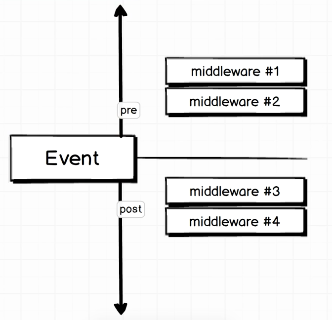

Middleware are functions that execute before or after certain distinct events that take place with Mongoose. There are two types of middleware:
- **Pre:** before an event takes place
- **Post:** after an event takes place.



### After removing a instance of collection, remove also it's association
For example, after we remove a user, we also want to remove it's associated blog posts. In order to do this we would include the middleware in the user model through the following code:
```js
/*
  Make sure not to use a a fat arrow function as we have to refer to the instance through `this`
  Here we state, before removing the user do this:
*/
UserSchema.pre('remove', function(next) {
  // require the collections that includes the assocation that has to be removed
  const BlogPost = mongoose.model('blogPost');

  /*
    blogPosts is an array of id's
    this refers to the instance of the user Joe
    the $in operating says go through all the records of the blogPosts collections
    If the _id's are "in" this.blogPosts => delete it
  */
  BlogPost.remove({ _id: { $in: this.blogPosts } })
    /*
      This middleware is an asyncronous function
      We don't continue with the `next` middleware untill this is completed
    */
    .then(() => next());
});
```

